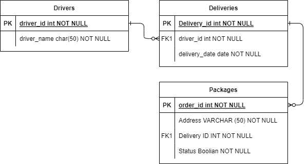

# QA_Hackfest_Team_C

## Delivery Routing Flask App

## Authored by Ben, Sam, Harry and Sibel

### Overview
The flask application is designed to make a logistics system for a delivery company.
The application will have drivers, deliveries and packages. Thet should all interact with each other
and 

### Risk assessment

### Front End

### Trello Link
[View Our Trello!](https://trello.com/b/PukNG31j/qahackfestteamc)

### ERD Diagram
This is our ERD for the Hackfest

